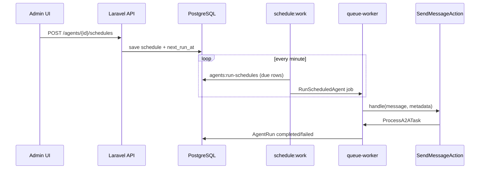

# Запуск агентов по расписанию

## Кратко

Нужна возможность автоматически запускать агента в заданное время и управлять этим из админки (Vue SPA + Laravel API).

Сейчас агент стартует только по явному действию:

- чат в админке (`AgentChatController` → `SendMessageAction`);
- A2A JSON-RPC;
- каналы (Telegram и т.д.).

Планировщика для агентов пока нет. В проекте уже есть один cron-задачник Laravel — команда `a2a:recover-stale`, которая крутится каждую минуту в `routes/console.php`. Новую функциональность логично построить по тому же паттерну.

---

## Цели

1. Админ может создать расписание для конкретного агента: когда запускать, с каким сообщением, включено/выключено.
2. Запуск идёт через существующий пайплайн (`SendMessageAction` → `ProcessA2ATask`), без дублирования логики агента.
3. История запусков видна через уже существующие `agent_runs`.
4. Изменения в админке применяются без деплоя и без правки `.env`.

---

## Не-цели (на первом этапе)

- Сложные workflow (цепочки агентов, ветвления, ожидание ответа пользователя).
- Запуск «только если предыдущий run ещё не завершился» — можно добавить позже как опцию.
- Отдельный микросервис планировщика.

---

## Текущая архитектура (от чего отталкиваемся)

```text
Админка / A2A / Telegram
        │
        ▼
 SendMessageAction
        │
        ├── создаёт AgentRun
        ├── сохраняет A2A task
        └── dispatch ProcessA2ATask (очередь)
                    │
                    ▼
              Neuron runtime
```

Уже есть:

| Компонент | Где |
|-----------|-----|
| Запуск агента | `app/A2A/SendMessageAction.php` |
| Очередь | `queue-worker` в `docker-compose.yml` |
| Scheduler hook | `routes/console.php` → `Schedule::command(...)` |
| CRUD из админки | паттерн `AgentChannel` + `AgentChannelsEditor.vue` |
| Auth API | `routes/api.php`, middleware `auth` |

**Важно:** в `docker-compose.yml` есть `queue-worker`, но нет контейнера `schedule:run`. Без него Laravel Scheduler не будет работать в Docker, даже если расписание прописано в коде.

---

## Рекомендуемый подход

### Идея

Хранить расписания в БД. Раз в минуту artisan-команда ищет записи, у которых `next_run_at <= now()`, и для каждой диспатчит job запуска агента.

Почему так:

- расписание редактируется из админки без redeploy;
- cron-выражение можно пересчитывать при сохранении;
- тот же механизм, что уже используется для `a2a:recover-stale`;
- не нужны внешние сервисы.

### Альтернативы (и почему не они)

| Подход | Минус |
|--------|-------|
| Хардкод в `routes/console.php` | нельзя менять из админки |
| `metadata` на модели `Agent` | быстро, но плохо масштабируется (несколько расписаний, история, UI) |
| Laravel `->delay()` на job при сохранении | сложно обновлять/удалять при edit в админке |
| Отдельный cron на каждое расписание | неудобно при десятках агентов |

---

## Модель данных

### Таблица `agent_schedules`

```sql
agent_schedules
├── id
├── uuid                    -- для API (как у agent_channels)
├── agent_id                -- FK → agents
├── name                    -- "Утренний дайджест", "Проверка инбокса"
├── enabled                 -- bool, default true
├── timezone                -- string, default app timezone
├── schedule_type           -- enum: cron | daily | weekly | interval
├── schedule_config         -- json (см. ниже)
├── message                 -- text, стартовое сообщение агенту
├── context_id              -- nullable, фиксированный контекст чата
├── metadata                -- json (source, tags, notify и т.д.)
├── last_run_at             -- nullable datetime
├── last_run_id             -- nullable FK → agent_runs.id
├── last_error              -- nullable text
├── next_run_at             -- datetime, индекс
├── created_at / updated_at
```

Индексы:

- `(enabled, next_run_at)` — выборка due schedules;
- `agent_id`.

### `schedule_config` по типам

**`daily`**

```json
{
  "time": "09:00",
  "days_of_week": [1, 2, 3, 4, 5]
}
```

**`weekly`**

```json
{
  "time": "10:30",
  "day_of_week": 1
}
```

**`interval`**

```json
{
  "every_minutes": 60
}
```

**`cron`**

```json
{
  "expression": "0 9 * * 1-5"
}
```

Для UI в админке лучше показывать простые пресеты (`daily`, `weekly`, `interval`) и «Advanced» с raw cron. Внутри всё можно нормализовать в cron через библиотеку `dragonmantank/cron-expression` (уже транзитивно есть в Laravel).

### Таблица `agent_schedule_runs` (опционально, но полезно)

Связь «расписание → конкретный запуск» для UI и отладки:

```sql
agent_schedule_runs
├── id
├── agent_schedule_id
├── agent_run_id
├── status              -- queued | started | completed | failed | skipped
├── scheduled_for       -- datetime (когда должен был стартовать)
├── started_at
├── finished_at
├── error
├── created_at
```

Если не хочется отдельную таблицу на MVP — достаточно писать в `agent_runs.input`:

```json
{
  "source": "schedule",
  "agent_schedule_id": 12,
  "scheduled_for": "2026-06-10T09:00:00+03:00"
}
```

---

## Backend

### 1. Модель и миграция

```
app/Models/AgentSchedule.php
database/migrations/xxxx_create_agent_schedules_table.php
```

Связь на `Agent`:

```php
public function schedules(): HasMany
{
    return $this->hasMany(AgentSchedule::class);
}
```

Сервис пересчёта следующего запуска:

```
app/Scheduling/AgentScheduleCalculator.php
```

При `store` / `update` / `enable` / `disable`:

1. валидировать config;
2. посчитать `next_run_at` через cron expression;
3. сохранить.

### 2. Job запуска

```
app/Jobs/RunScheduledAgent.php
```

Логика:

```php
public function handle(SendMessageAction $sendMessage): void
{
    if (! $schedule->enabled || ! $schedule->agent->is_active) {
        return;
    }

    // опционально: skip if overlap
    // if ($schedule->skip_if_running && $this->hasActiveRun($schedule)) return;

    $runId = (string) Str::uuid();

    $task = $sendMessage->handle(
        agentSlug: $schedule->agent->slug,
        message: $payloads->userMessage($schedule->message),
        metadata: [
            'agent_run_id' => $runId,
            'context_id' => $schedule->context_id ?? (string) Str::uuid(),
            'source' => 'agent_schedule',
            'agent_schedule_id' => $schedule->id,
            'scheduled_for' => $schedule->next_run_at?->toIso8601String(),
        ],
    );

    $schedule->update([
        'last_run_at' => now(),
        'last_run_id' => $runId,
        'last_error' => null,
        'next_run_at' => $calculator->nextRunAt($schedule),
    ]);
}
```

Job implements `ShouldQueue`, чтобы scheduler-команда не блокировалась на LLM.

### 3. Artisan-команда

```
app/Console/Commands/RunDueAgentSchedulesCommand.php
```

Signature: `agents:run-schedules {--limit=50} {--dry-run}`

Алгоритм:

1. выбрать `AgentSchedule` where `enabled = true` and `next_run_at <= now()` order by `next_run_at`, limit N;
2. для каждой — `RunScheduledAgent::dispatch($schedule->id)`;
3. **сразу** обновить `next_run_at` на следующий слот (optimistic), чтобы двойной tick scheduler не создал дубликат;
4. если job упал до старта — recovery через `last_run_at` / retry (см. edge cases).

Регистрация в `routes/console.php`:

```php
Schedule::command('agents:run-schedules')->everyMinute()->withoutOverlapping();
Schedule::command('a2a:recover-stale')->everyMinute();
```

### 4. API для админки

По аналогии с `AgentChannelController`:

| Method | Path | Действие |
|--------|------|----------|
| GET | `/agents/{agent}/schedules` | список |
| POST | `/agents/{agent}/schedules` | создать |
| GET | `/agent-schedules/{uuid}` | детали + last run |
| PATCH | `/agent-schedules/{uuid}` | обновить |
| DELETE | `/agent-schedules/{uuid}` | удалить |
| POST | `/agent-schedules/{uuid}/run-now` | ручной запуск (тест) |

Form Requests:

- валидация `message` (required, max length как в чате — 20000);
- валидация cron / time / timezone;
- запрет расписания для `is_active = false` агента (или warning в UI).

Ответ API — тот же стиль, что у channels: `{ data: ... }`.

### 5. Docker: scheduler container

Добавить в `docker-compose.yml`:

```yaml
scheduler:
  build:
    context: .
    dockerfile: docker/php/Dockerfile
  working_dir: /var/www/html
  restart: unless-stopped
  command: php artisan schedule:work
  volumes:
    - .:/var/www/html
  env_file:
    - .env
  depends_on:
    postgres:
      condition: service_healthy
```

`schedule:work` — long-running процесс Laravel, удобнее чем системный cron внутри контейнера.

Для локальной разработки без Docker — добавить в `composer.json` script `dev` ещё один процесс:

```bash
php artisan schedule:work
```

---

## Админка (Vue)

### Где разместить UI

**Вариант A (рекомендуется):** вкладка «Schedules» на странице агента `/agents/:agentId`, рядом с Channels / Tools / State Processors.

**Вариант B:** отдельная страница `/schedules` со списком всех расписаний по всем агентам.

Для MVP достаточно варианта A — меньше навигации, контекст агента уже есть.

### Компонент

```
resources/js/features/agents/AgentSchedulesEditor.vue
```

Паттерн — скопировать структуру `AgentChannelsEditor.vue`:

- список карточек расписаний;
- dialog create/edit;
- switch enabled;
- кнопки «Run now», «Delete»;
- badge со статусом last run (success / failed / never).

### Поля формы

| Поле | UI |
|------|-----|
| Name | Input |
| Enabled | Switch |
| Schedule type | Select: Daily / Weekly / Every N minutes / Cron |
| Time | Time picker (для daily/weekly) |
| Days of week | Checkbox group |
| Timezone | Select (default из Settings или browser) |
| Message | Textarea с подсказкой «Стартовый prompt для агента» |
| Context | Select existing chat context или «New context each run» |

### Отображение last run

- ссылка на run в истории чатов (`/agents/:id/chats` или конкретный context);
- время `last_run_at`;
- `last_error`, если job не стартовал.

### API client

```
resources/js/lib/api.js
```

Функции: `listAgentSchedules`, `createAgentSchedule`, `updateAgentSchedule`, `deleteAgentSchedule`, `runAgentScheduleNow`.

---

## Поток данных



---

## Edge cases

### Пропущенный запуск (сервер был down)

При старте команды: если `next_run_at` сильно в прошлом — два режима (настраивается на schedule):

- **`catch_up: false`** (default) — пропустить missed, взять следующий слот от `now()`;
- **`catch_up: true`** — выполнить один раз «за прошлое», потом перейти к обычному циклу.

### Дубликаты при overlap scheduler

Решение:

1. `withoutOverlapping()` на schedule command;
2. при dispatch сразу сдвинуть `next_run_at`;
3. unique job id: `RunScheduledAgent:{schedule_id}:{next_run_at_timestamp}`.

### Агент уже выполняется

Опция `skip_if_running`:

```php
AgentRun::query()
    ->where('agent_slug', $agent->slug)
    ->whereIn('state', ['submitted', 'working', 'waiting_for_tool'])
    ->exists();
```

Если true — пометить run как `skipped`, не вызывать LLM.

### Неактивный агент

Если `agent.is_active = false` — schedule остаётся в БД, но команда его игнорирует. В UI показать предупреждение.

### Timezone

- хранить `timezone` на schedule;
- `next_run_at` считать в UTC, отображать в timezone пользователя;
- использовать `Carbon` + `->timezone($schedule->timezone)`.

### Длинные run'ы

Scheduled job только **ставит** задачу в очередь. Таймаут LLM — существующий `timeout_seconds` агента и `ProcessA2ATask`.

---

## Безопасность

- все endpoints только под `auth` middleware (как сейчас);
- `message` — обычный prompt, не выполнять shell;
- rate limit на `run-now` (например 10/min per user), чтобы не спамили LLM;
- логировать `agent_schedule_id` в `agent_runs.input` для аудита.

---

## MVP — минимальный scope

Чтобы быстро получить рабочую версию:

1. Миграция `agent_schedules` (без `agent_schedule_runs`).
2. Model + Calculator + `RunScheduledAgent` + `agents:run-schedules`.
3. CRUD API под агентом.
4. `AgentSchedulesEditor.vue` на странице агента.
5. `scheduler` service в docker-compose.
6. Типы расписания: **daily** и **interval** (cron — phase 2).

Оценка: ~1–2 дня backend + ~1 день frontend при наличии паттерна channels.

---

## Phase 2 (после MVP)

- raw cron expression в UI;
- глобальная страница `/schedules`;
- `skip_if_running`, `catch_up`;
- шаблоны message с переменными (`{{date}}`, `{{agent.name}}`);
- уведомление в Slack/Telegram по результату run;
- метрики: сколько runs, средняя стоимость (интеграция с Gemini cost tracking).

---

## Чеклист перед продакшеном

- [ ] Контейнер `scheduler` запущен и живёт (`schedule:work`)
- [ ] `queue-worker` обрабатывает `RunScheduledAgent` и `ProcessA2ATask`
- [ ] В логах видно `source: agent_schedule` в metadata run
- [ ] Ручной «Run now» из админки работает
- [ ] Смена timezone пересчитывает `next_run_at`
- [ ] Disable schedule не создаёт новых runs
- [ ] Тест: расписание «через 2 минуты» → run появился в `agent_runs`

---

## Пример конфигурации

**Задача:** каждый будний день в 9:00 агент `inbox-assistant` проверяет почту.

| Поле | Значение |
|------|----------|
| agent | `inbox-assistant` |
| name | Weekday inbox check |
| schedule_type | daily |
| schedule_config | `{ "time": "09:00", "days_of_week": [1,2,3,4,5] }` |
| timezone | `Europe/Kyiv` |
| message | `Review new messages since the last check. Summarize action items.` |
| context_id | `null` (новый context каждый раз) или фиксированный UUID для накопления истории |

---

## Связанные файлы в репозитории

| Файл | Роль |
|------|------|
| `app/A2A/SendMessageAction.php` | единая точка старта агента |
| `app/Jobs/ProcessA2ATask.php` | выполнение в очереди |
| `routes/console.php` | регистрация scheduler |
| `app/Channels/Models/AgentChannel.php` | образец связанной сущности агента |
| `resources/js/features/agents/AgentChannelsEditor.vue` | образец UI редактора |
| `docker-compose.yml` | нужен новый service `scheduler` |
